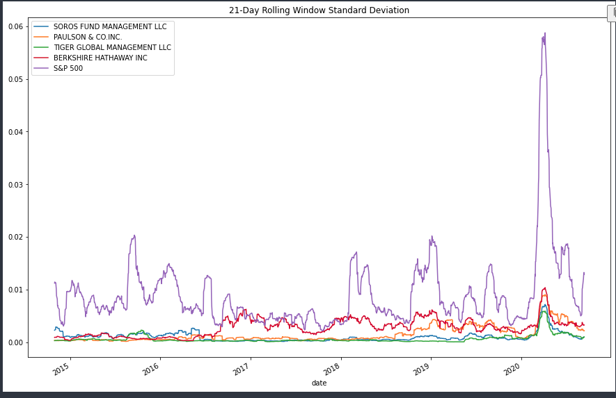

# Risk Return Analysis

This notebook analyzes several funds to direct investment decisions based on comparative performance to the S&P 500.

---

## Technologies

This project leverages Python 3.7 with the following packages:

* [Pandas](https://pandas.pydata.org/docs/) - Data analysis and manipulation tool

* [Path](https://docs.python.org/3/library/pathlib.html) - Offers classes representing filesystem paths with semantics appropriate for different operating systems

* [NumPy](https://numpy.org/doc/stable/) - Fundamental package for scientific computing in Python

---

## Installation Guide

Before running the application, first install the following dependencies.

```python
  pip install pandas
  pip install pathlib
  pip install numpy
```

---

## Examples

Upon running the notebook, you will see several graphics assisting in your analysis



---

## Usage

To use the risk return analysis notebook, open risk_return_analysis.ipynb in a Jupyter Lab environment (or other IDE with Jupyter notebook extensions):

---

## Contributors

Pull requests are welcome. For major changes, please open an issue first to discuss what you would like to change.

Please make sure to update tests as appropriate.

---

## License

N/A
